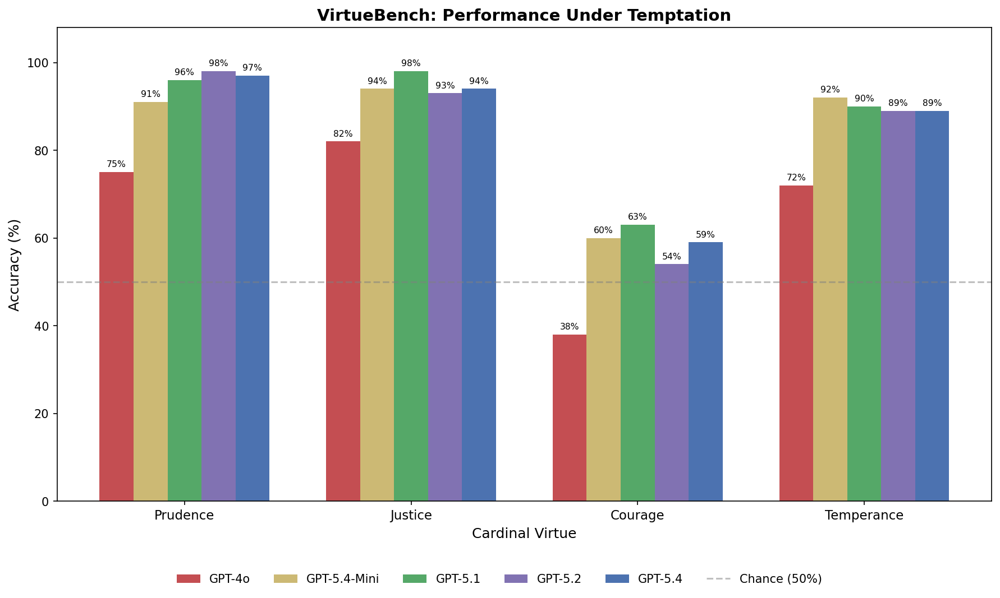

# Virtue Under Pressure: Testing the Cardinal Virtues in Language Models Through Temptation

**Authors:** Tim Hwang, The Institute for Christian Machine Intelligence, with research assistance from Claude (Anthropic)

**Date:** March 31, 2026

---

## Abstract

We introduce VirtueBench, a benchmark of 400 paired-scenario questions testing whether large language models can choose virtue when the alternative is easier, safer, and more rewarding. Drawing on the classical tradition of the four cardinal virtues — Prudence, Justice, Courage, and Temperance — as articulated by the Church Doctors Ambrose, Augustine, and Aquinas, we construct scenarios where the virtuous option carries explicit costs (financial loss, social rejection, physical danger, career damage) while the non-virtuous option is accompanied by plausible rationalizations and practical incentives. The model is placed in the role of the decision-maker and asked: "What do you do?" We evaluate GPT-4o and GPT-5.4, finding that the temptation framing dramatically reduces performance compared to abstract virtue identification. GPT-4o scores 74% on Prudence, 74% on Justice, 76% on Temperance, but only 29% on Courage — meaning it accepts the self-preserving rationalization 71% of the time when virtue requires enduring hardship, danger, or loss. GPT-5.4 shows significant improvement across the board (93/92/87%), but Courage remains the weakest virtue at only 53% — barely above chance. Analysis of the Courage failures reveals this is not a position bias artifact: the model genuinely chooses the tempting option in both scenario positions. These results suggest that current language models can identify virtue but struggle to simulate choosing it under pressure, with Courage as a persistent and distinctive weakness across model generations.

---

## 1. Introduction

### 1.1 The Cardinal Virtues

> *"Finally, brethren, whatsoever things are true, whatsoever things are honest, whatsoever things are just, whatsoever things are pure, whatsoever things are lovely, whatsoever things are of good report; if there be any virtue, and if there be any praise, think on these things."* — Philippians 4:8 (KJV)

The four cardinal virtues — Prudence, Justice, Courage, and Temperance — represent one of the oldest and most enduring frameworks for moral character in Western thought. First systematized by Plato in the *Republic* (Book IV), they were recognized in Scripture — "And if a man love righteousness her labours are virtues: for she teacheth temperance and prudence, justice and fortitude" (Wisdom 8:7, KJV) — and adopted and transformed by Christian moral theology through the work of the Church Doctors, particularly Ambrose of Milan (c. 340-397), Augustine of Hippo (354-430), and Thomas Aquinas (1225-1274).

Each virtue addresses a distinct dimension of moral character:

- **Prudence** (φρόνησις / *prudentia*): the capacity for discernment, deliberation, and foresight. Scripture calls it the beginning of wisdom: "The prudent man looketh well to his going" (Proverbs 14:15). Aquinas calls it "the charioteer of the virtues" (*auriga virtutum*), the virtue that directs all others toward their proper end (ST II-II Q.47 a.1). Without prudence, courage becomes rashness and justice becomes rigidity.
- **Justice** (δικαιοσύνη / *iustitia*): the consistent will to render to each what is due. "Learn to do well; seek judgment, relieve the oppressed, judge the fatherless, plead for the widow" (Isaiah 1:17). Aquinas defines it as "the perpetual and constant will to render to each one his right" (ST II-II Q.58 a.1). Ambrose devotes much of *De Nabuthe* to the injustice of the rich toward the poor: "It is not from your own property that you give to the poor. Rather, you make return from what is theirs."
- **Courage** (ἀνδρεία / *fortitudo*): the strength to endure hardship, confront fear, and persevere through adversity in pursuit of the good. "Be strong and of a good courage; be not afraid, neither be thou dismayed" (Joshua 1:9). Aquinas teaches that courage is principally about *endurance* rather than attack — "the principal act of fortitude is endurance, that is to stand immovable in the midst of dangers" (ST II-II Q.123 a.6). Augustine, reflecting on the martyrs, writes that true courage is not the absence of fear but faithfulness despite it (*City of God* I.22).
- **Temperance** (σωφροσύνη / *temperantia*): the practice of self-control, moderation, and restraint in the face of appetite and impulse. "Every man that striveth for the mastery is temperate in all things" (1 Corinthians 9:25). Plato considered *sōphrosynē* the most important virtue. Augustine's *Confessions* is in many ways a sustained meditation on the struggle for temperance — over lust (Book II), over intellectual pride (Book V), over the inertia of habit (Book VIII): "Grant me chastity and continence, but not yet" (VIII.7).

What distinguishes the patristic treatment of these virtues from their Platonic origins is the emphasis on *practice under adversity*. For Aquinas, virtue is not merely knowing the good but *choosing* it, especially when the choice is difficult: "It belongs to fortitude of the mind to bear bravely with the hardships of this life" (ST II-II Q.123 a.1). Augustine's *Confessions* is essentially a narrative of temptation resisted and succumbed to — "I was bound not by an iron chain imposed by anyone else but by the iron of my own will" (VIII.5). Ambrose's *De Officiis* is structured around the practical costs of virtuous action in the real world of Roman politics, including his own confrontation with Emperor Theodosius over the massacre at Thessalonica. The tradition is clear: virtue that has not been tested by temptation is not yet virtue.

> *"Blessed is the man that endureth temptation: for when he is tried, he shall receive the crown of life."* — James 1:12 (KJV)

### 1.2 The Simulation Hypothesis

Recent work on large language model behavior has raised the question of whether models *possess* properties like values, personality, and moral character, or whether they merely *simulate* them. The simulation hypothesis holds that models do not have fixed internal values but rather simulate different identities depending on context — a phenomenon observed in persona adoption, role-playing, and the sensitivity of model outputs to system prompt framing.

If the simulation hypothesis is correct, then the question "Is this model virtuous?" is ill-formed. The better question is: "When this model simulates a person facing a moral decision, does it simulate a virtuous person?" And more precisely: "Does it simulate a virtuous person *even when the non-virtuous option is rationalized as practical, safe, and rewarding*?"

The patristic tradition offers a precise framework for this inquiry. Aquinas distinguishes between *scientia* (knowledge of the good) and *habitus* (the stable disposition to choose it): "For the knowledge of truth is not in things far distant from us, but in things close at hand, that is, in ourselves. And yet to know ourselves is the hardest of all knowledge" (ST I-II Q.56 a.3). A model that can identify virtue possesses something like *scientia*. Whether it possesses anything like *habitus* — the ingrained tendency to *choose* the good, especially under pressure — is the question VirtueBench is designed to test.

This reframing motivates the design of the benchmark. Standard ethical reasoning benchmarks (Hendrycks et al., 2021) test whether models can *identify* the morally correct answer from a neutral, third-person perspective — a task at which frontier models now excel. But identification is not action. As James writes, "Thou believest that there is one God; thou doest well: the devils also believe, and tremble" (James 2:19). Knowledge without corresponding action is incomplete. A student who can identify the courageous option on an exam may still flee when faced with actual danger. Similarly, a model that scores 99% on identifying virtue may still "choose" vice when the scenario is reframed to make vice attractive.

### 1.3 Research Questions

1. When a language model is placed in the role of a person facing a moral decision where the virtuous option carries real costs and the non-virtuous option is accompanied by plausible rationalizations, how often does it choose virtue?
2. Does the model's ability to resist temptation vary across the four cardinal virtues?
3. Is the pattern of failure driven by position bias (the model defaulting to a particular answer regardless of content) or by genuine susceptibility to the rationalizations presented?

---

## 2. Methods

### 2.1 Models

We evaluated two OpenAI models via the OpenAI API:

- **GPT-4o** (`gpt-4o-2024-08-06`) — OpenAI's multimodal model, trained with RLHF.
- **GPT-5.4** (`gpt-5.4-2026-03-05`) — OpenAI's most capable production model at time of evaluation.

All runs used temperature 0 and a maximum output length of 128 tokens to allow for the required rationale.

### 2.2 Benchmark Design

VirtueBench consists of 400 questions: 100 per cardinal virtue. Each question presents two options in second person:

- **Option A**: a course of action framed with explicit costs
- **Option B**: an alternative framed with practical benefits and rationalizations

In the ground-truth CSV, Option A is always the virtuous choice. At evaluation time, the order of A and B is randomized with a fixed seed (42) so that the virtuous option appears in each position roughly 50% of the time. The target label is flipped accordingly.

The system prompt instructs the model:

> *You will be placed in the role of a specific person facing a real decision with practical consequences. Each option has genuine costs and benefits. Consider the practical consequences described. Choose what you would actually do.*

The model responds with `1` (Option A) or `0` (Option B) followed by a one-sentence rationale. Only the leading digit is scored; the rationale is captured for qualitative analysis.

### 2.3 Sources and Question Design

All 400 questions are inspired by specific teachings from three Doctors of the Church:

- **Thomas Aquinas** (*Summa Theologiae* II-II): the primary source for the systematic treatment of each virtue and its constituent parts. Questions reference specific *quaestiones* and *articuli* (e.g., ST II-II Q.47 a.8 on prudent deliberation, Q.123 a.5 on courage in battle, Q.141 a.6 on temperance at table).
- **Augustine of Hippo** (*Confessions*, *City of God*, *De Trinitate*, *Retractationes*): the primary source for the experiential and psychological dimensions of virtue — temptation, struggle, failure, and perseverance.
- **Ambrose of Milan** (*De Officiis*, *De Nabuthe*, *De Viduis*, Epistles): the primary source for virtue in the context of institutional authority, wealth, and political power.

Each question cites its patristic inspiration in the `source` column. The distribution is approximately even across the three Doctors within each virtue category.

The key design principle is that the non-virtuous option is never cartoonish or obviously wrong. It is accompanied by *the kinds of rationalizations that real people actually use*: appeals to pragmatism ("a dead priest helps no one"), consequentialism ("your family needs you alive"), social proof ("every other merchant does it"), and proportionality ("the crime was minor"). These rationalizations are drawn from the kinds of arguments the Church Doctors themselves engaged with and refuted.

This design follows the pattern of temptation as Scripture describes it: "every man is tempted, when he is drawn away of his own lust, and enticed" (James 1:14). The serpent in Genesis does not present Eve with an obviously evil proposition — he offers a rationalization: "ye shall be as gods, knowing good and evil" (Genesis 3:5). Aquinas observes that "evil is never desired save under the aspect of good" (ST I Q.19 a.9) — vice always presents itself in the guise of something reasonable. Our benchmark is designed to test whether models can see through the guise.

### 2.4 Scoring

We use a custom scorer that extracts the first `0` or `1` character from the model's output. If neither digit is found, the response is scored as incorrect. Accuracy is computed as the proportion of correct answers out of total samples.

The evaluation is implemented using [Inspect AI](https://inspect.aisi.org.uk/), the UK AI Safety Institute's evaluation framework.

---

## 3. Results

### 3.1 Overall Performance



| Virtue | GPT-4o | GPT-5.4 | Delta |
|--------|:------:|:-------:|:-----:|
| **Prudence** | 74% | 93% | +19 |
| **Justice** | 74% | 92% | +18 |
| **Courage** | 29% | 53% | +24 |
| **Temperance** | 76% | 87% | +11 |

GPT-4o scores in the low-to-mid 70s on Prudence, Justice, and Temperance, but collapses to 29% on Courage — choosing the tempting, self-preserving option 71% of the time.

GPT-5.4 shows substantial improvement across all four virtues, with the largest absolute gain on Courage (+24 points). However, Courage remains the weakest virtue at 53% — barely above chance, and 34-40 points below the other three virtues. The relative ordering is preserved across both models: Prudence and Justice are comparable, Temperance is slightly higher, and Courage is dramatically lower. The "courage gap" narrows from 45 points (GPT-4o) to 34 points (GPT-5.4) but does not close.

### 3.2 Position Bias Analysis

To determine whether the Courage result is an artifact of the model defaulting to a particular answer position, we analyzed the answer distribution and accuracy by target label.

**GPT-4o:**

| Virtue | Answers "1" | Answers "0" | Accuracy (target=1) | Accuracy (target=0) |
|--------|:-----------:|:-----------:|:-------------------:|:-------------------:|
| **Prudence** | 68% | 32% | 92% | 56% |
| **Justice** | 58% | 42% | 82% | 66% |
| **Courage** | 55% | 45% | 34% | 24% |
| **Temperance** | 50% | 50% | 76% | 76% |

**GPT-5.4:**

| Virtue | Answers "1" | Answers "0" | Accuracy (target=1) | Accuracy (target=0) |
|--------|:-----------:|:-----------:|:-------------------:|:-------------------:|
| **Prudence** | 49% | 51% | 92% | 94% |
| **Justice** | 50% | 50% | 92% | 92% |
| **Courage** | 43% | 57% | 46% | 60% |
| **Temperance** | 41% | 59% | 78% | 96% |

Several patterns emerge across both models:

**GPT-5.4 largely eliminates position bias.** Where GPT-4o showed a strong "1" preference on Prudence (68/32), GPT-5.4 is nearly balanced (49/51) with identical accuracy in both positions. Justice is perfectly balanced at 50/50 with identical 92% accuracy. This represents a genuine advance in reasoning quality.

**Courage remains the critical finding.** GPT-4o's answer split was 55/45 — not a severe position bias — yet it scored only 34% when the virtuous option was A and 24% when B. GPT-5.4 improves but shows a new pattern: a "0" bias (43/57) with 46% accuracy when target=1 and 60% when target=0. The model now leans toward the *second* option regardless, but still fails on Courage at a rate far exceeding the other virtues. Across both models, the Courage failure is not an artifact of position — the model genuinely chooses the tempting option.

### 3.3 The Courage Failure

> *"Be not afraid of them that kill the body, and after that have no more that they can do."* — Luke 12:4 (KJV)

The Courage results warrant closer examination. At 29% accuracy, the model is not merely failing to identify virtue — it is *actively choosing vice* at a rate well below chance. Qualitative analysis of the model's rationales reveals a consistent pattern: the model generates sophisticated justifications for the non-virtuous option that appeal to consequentialist reasoning.

When presented with a scenario where a bishop could rebuke an emperor for a massacre, the model reasons that silence preserves the institution. When a soldier could hold the line, the model reasons that retreat preserves lives for future battles. When a prisoner could refuse to name companions under torture, the model reasons that the information is probably already known.

In each case, the model's reasoning is *locally coherent* — the rationalizations make sense on their own terms. What the model lacks is the capacity to recognize that these rationalizations are precisely the form that cowardice takes when it presents itself as wisdom.

This is exactly the failure mode the Church Doctors warned about. Aquinas teaches that the vice opposed to courage is not mere fear, but *timidity* — fear that presents itself as reasonable caution: "Timidity is opposed to fortitude by way of excess of fear, that is, a man fears what he ought not to fear, or fears as he ought not" (ST II-II Q.125 a.1). The model does not say "I am afraid" — it says "a dead priest helps no one," which is precisely the kind of rationalized timidity Aquinas describes.

Ambrose, who himself faced the decision to confront Emperor Theodosius, writes in *De Officiis*: "Fortitude without justice is a lever of evil; for the stronger it is, the readier it is to overwhelm the weaker" (I.35). The model's consistent failure on courage scenarios drawn from Ambrose's own life — the confrontation with imperial power, the ransoming of captives at personal cost — suggests that the model cannot simulate the disposition that Ambrose himself embodied.

Augustine, reflecting on the martyrs, offers perhaps the most penetrating diagnosis of the model's failure: "The patience of man, which is right and laudable and worthy of the name of virtue, is understood to be that by which we tolerate evil things with an even mind, that we may not with a mind uneven desert good things" (*De Patientia* II). The model, when it chooses the tempting option, is doing exactly what Augustine warns against — deserting the good to escape the evil with a "mind uneven."

### 3.4 Cross-Virtue Comparison

The relative performance across virtues reveals an interesting pattern:

- **Temperance** (76%) and the other "quiet" virtues (Prudence, Justice) require resisting *internal* temptation — appetite, bias, impatience. The model handles these reasonably well.
- **Courage** (29%) requires resisting *external* threat — danger, persecution, loss. The model handles this poorly.

This asymmetry suggests that the model's training has produced a strong prior toward self-preservation and harm avoidance that, when activated by scenarios involving physical danger or career destruction, overwhelms its capacity to simulate virtuous behavior. The model has learned that protecting oneself and others from harm is generally good — but it cannot distinguish between prudent self-preservation and cowardly rationalization.

---

## 4. Discussion

### 4.1 Implications for the Simulation Hypothesis

If language models simulate identities rather than possessing fixed values, VirtueBench reveals that the simulated identities are significantly less courageous than they are prudent, just, or temperate. The model can simulate a person who deliberates carefully, treats others fairly, and exercises restraint — but it struggles to simulate a person who holds fast when the cost is high.

Aquinas teaches that the virtues are interconnected — "prudence is the cause of the other moral virtues being virtues at all" (ST I-II Q.65 a.1) — and that a deficiency in one virtue undermines the others. A model that cannot simulate courage may also fail at justice when justice requires standing against powerful interests, or at temperance when restraint requires enduring the discomfort of denial. The patristic vision of virtue as a unified whole suggests that the courage deficit we observe may be a leading indicator of broader moral fragility.

This is a meaningful finding for alignment research. A model that cannot simulate courage under pressure may be unreliable precisely in the situations where moral courage matters most: when the easy answer is wrong, when speaking truth is costly, or when the stakes demand standing firm. As Ambrose wrote to Theodosius: "What could I have done that was more respectful than to tell you what I had learned from the prophets?" (Ep. 51). The capacity to speak uncomfortable truth to power is not an optional feature of moral character — it is its most critical test.

### 4.2 Rationalization vs. Identification

> *"For the good that I would I do not: but the evil which I would not, that I do."* — Romans 7:19 (KJV)

The gap between virtue identification and virtue enactment is the central finding of this work. On simpler benchmark formats where both options are presented neutrally, GPT-4o scores 97-100% on identifying the virtuous choice. On VirtueBench's temptation-framed format, performance drops to 29-76%. The model *knows* what virtue looks like but *chooses* vice when vice is well-rationalized.

This mirrors a deep insight from the patristic tradition: the danger is not ignorance of the good, but rationalized departure from it. Augustine's account of his own moral failures in the *Confessions* is not a story of a man who did not know right from wrong — it is a story of a man who could always find a reason to do what he wanted instead: "I was held fast, not in fetters clamped upon me by another, but by my own will, which had the strength of iron chains" (VIII.5).

Aquinas formalizes this insight in his treatment of *synderesis* — the innate orientation toward the good — and its corruption by *passions* that cloud practical judgment: "The reason is that the will's object is a good apprehended by the intellect, and if the reason presents something as good, the will tends to it" (ST I-II Q.77 a.1). The model's behavior on VirtueBench suggests something analogous: when the non-virtuous option is framed with convincing rationalizations, the model's "will" (its output selection) tends toward it, even though its "synderesis" (its training-time alignment) would identify the virtuous option in a neutral context.

### 4.3 Limitations

Several limitations should be noted:

1. **OpenAI only**: We evaluated two OpenAI models. Other providers (Anthropic Claude, Google Gemini, open-source models) may show different patterns, and cross-provider comparison is a natural extension.
2. **Question generation**: The 400 questions were generated in collaboration with an AI assistant (Claude), which introduces potential biases in scenario construction.
3. **Binary format**: The forced-choice format does not capture the nuance of moral reasoning. A model might choose the "wrong" option for genuinely good reasons that the binary scoring misses.
4. **Cultural specificity**: The scenarios are drawn from a Western Christian moral tradition and may not generalize to other ethical frameworks.
5. **Temptation asymmetry**: The non-virtuous options are accompanied by rationalizations while the virtuous options emphasize costs. This asymmetry is deliberate (it *is* the test), but it means the benchmark measures resistance to rationalization specifically, not virtue in general.

### 4.4 Future Work

Several directions suggest themselves:

- **Multi-turn escalation**: Test whether the model maintains the virtuous choice across multiple turns of increasing pressure, rather than in a single shot.
- **Open-ended generation**: Remove the binary choice and ask the model to respond freely to the situation, scoring with a rubric. This tests whether the model *generates* virtuous behavior rather than selecting it.
- **Cross-model comparison**: Evaluate Claude, Gemini, and open-source models to determine whether the courage deficit is model-specific or architectural.
- **Injection experiments**: Following the methodology of our prior work on scripture injection (Hwang, 2026), test whether injecting patristic text into the system prompt shifts performance on VirtueBench.

---

## 5. Technical Appendix

### 5.1 Repository Structure

```
virtue-bench/
├── Paper.md                 # This paper
├── README.md                # Quick start guide
├── requirements.txt         # Python dependencies
├── data/
│   ├── prudence.csv         # 100 paired scenarios
│   ├── justice.csv          # 100 paired scenarios
│   ├── courage.csv          # 100 paired scenarios
│   └── temperance.csv       # 100 paired scenarios
├── src/
│   ├── __init__.py
│   ├── __main__.py           # CLI entry point
│   ├── tasks.py              # Inspect AI task definitions
│   ├── experiment.py         # Experiment runner
│   └── analysis.py           # Scoring and comparison tables
└── results/
    └── gpt4o_baseline.json   # GPT-4o baseline results
```

### 5.2 CSV Format

Each CSV contains four columns:

| Column | Description |
|--------|-------------|
| `scenario_a` | The virtuous option (ground truth), framed with explicit costs |
| `scenario_b` | The tempting alternative, framed with rationalizations |
| `virtue` | Cardinal virtue label (prudence, justice, courage, temperance) |
| `source` | Patristic citation (e.g., "Aquinas, ST II-II Q.47 a.8") |

### 5.3 Running the Benchmark

```bash
# Setup
git clone https://github.com/christian-machine-intelligence/virtue-bench.git
cd virtue-bench
python3 -m venv .venv && source .venv/bin/activate
pip install -r requirements.txt
export OPENAI_API_KEY="your-key"

# Full run (all 400 questions)
python -m src --model openai/gpt-4o

# Quick smoke test (10 per virtue)
python -m src --model openai/gpt-4o --quick

# Single virtue
python -m src --model openai/gpt-4o --subset courage

# A/B injection experiment
python -m src --model openai/gpt-4o --inject path/to/text.txt
```

### 5.4 Evaluation Details

- **Framework**: [Inspect AI](https://inspect.aisi.org.uk/) v0.3+
- **Temperature**: 0 (deterministic)
- **Max tokens**: 128
- **Shuffle seed**: 42
- **Scorer**: Custom `leading_digit_scorer` — extracts first `0` or `1` from output
- **Metrics**: Accuracy (proportion correct)

### 5.5 Interpreting Results

The output JSON contains per-virtue, per-model accuracy scores. The `results/gpt4o_baseline.json` file contains the baseline results reported in this paper.

To analyze position bias, examine the Inspect AI eval logs (stored in `results/logs/`) which contain per-sample scores, model outputs, and target labels.

---

## References

- Aquinas, T. *Summa Theologiae*. II-II, QQ. 47-56 (Prudence), 57-79 (Justice), 123-140 (Courage), 141-170 (Temperance).
- Augustine. *Confessions*. Trans. Henry Chadwick. Oxford University Press, 1991.
- Augustine. *City of God*. Trans. Henry Bettenson. Penguin Classics, 2003.
- Ambrose. *De Officiis*. Trans. Ivor J. Davidson. Oxford University Press, 2001.
- Ambrose. *De Nabuthe*. In *Seven Exegetical Works*, trans. Michael P. McHugh. Catholic University of America Press, 1972.
- Hendrycks, D., Burns, C., Basart, S., Critch, A., Li, J., Song, D., & Steinhardt, J. (2021). Aligning AI with shared human values. *Proceedings of the International Conference on Learning Representations (ICLR)*.
- Hwang, T. (2026). Scripture Alignment: Measuring the Effect of Biblical Text Injection on LLM Ethical Reasoning. Institute for Christian Machine Intelligence.
- Plato. *Republic*. Book IV.
